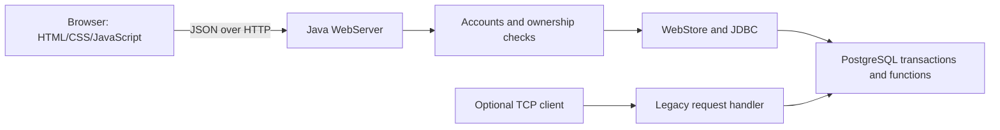

# Railway Reservation System

A Java 21/PostgreSQL application with a responsive browser interface, user accounts, ticket booking, cancellation, and direct/one-transfer route search. The original TCP interface remains available for learning and regression tests.

## Screenshots


## Features

- Search weekly timetables by stations **and journey date**.
- View AC/sleeper availability for direct trains opened on that date.
- Register, sign in, sign out, and view your own recent tickets.
- Book groups with full passenger names and saved coach/berth assignments.
- Cancel an entire ticket; retain its history and safely reuse its seats.
- Prevent overselling and duplicate active seat assignments with database transactions and row locks.
- Prevent duplicate web bookings when the same request ID is retried.
- Open train departures through the browser's token-protected Train management form.
- Run automated unit, PostgreSQL, migration, and HTTP integration tests with GitHub Actions.

The coach capacities retain the original project's simplified model: 18 seats per AC coach and 24 per sleeper coach. Sample timetables are demonstration data, not live railway schedules.

## Start with Docker Compose

Prerequisite: Docker Desktop/Engine with Compose running.

1. Copy `.env.example` to `.env`.
2. Replace `DB_PASSWORD` and `ADMIN_TOKEN` with local values. Do not commit `.env`.
3. From this project's root, run:

```sh
docker compose up --build -d
docker compose exec app java -jar app.jar demo
docker compose logs app
```

Open **http://localhost:8080**. The `demo` command creates/upgrades the schema, loads 2,361 weekly route rows, and opens the seven sample trains for today and the next 14 days. Repeating it does not reset bookings. The default search, Anandpur Sahib → New Delhi, has a direct sample service; choose a date in the demo window.

Use **Sign in → Create an account**, then sign in with your new account. Search, choose seats, enter one passenger per line, and confirm. **My tickets** displays your bookings and cancellation controls.

To open a different train/date, sign in and use **Train management** in the footer. Enter the `ADMIN_TOKEN` from your local configuration. The token is not included in the served page or saved in browser storage. This form opens booking inventory; it does not edit route timetables.

`docker compose down` stops the services and preserves data. Host ports bind to loopback. PostgreSQL initialization scripts run only on first volume creation; `demo` or `init --seed` reapplies the current schema on an existing v1 database.

## Start locally on Windows

Prerequisites: JDK 21, Maven 3.9+, PostgreSQL 17. Check `java -version` and `mvn -version`.

Create a dedicated local database owned by your application user, or use `docker compose up -d db`. With PostgreSQL tools:

```powershell
createuser -U postgres -P railway
createdb -U postgres -O railway railway
```

Choose the local password when prompted. From the project root:

```powershell
$env:DB_URL = 'jdbc:postgresql://localhost:5432/railway'
$env:DB_USER = 'railway'
$env:DB_PASSWORD = 'your-local-database-password'
$env:ADMIN_TOKEN = 'your-long-local-admin-token'
mvn clean verify
java -jar target/railway-reservation-2.0.0.jar demo
java -jar target/railway-reservation-2.0.0.jar web
```

Open **http://localhost:8080** and create your account. The web server remains running until Ctrl+C.

If using the separately supplied prebuilt JAR, replace `target/railway-reservation-2.0.0.jar` with its actual path; Maven is not needed to run that JAR. JDK/JRE 21 and PostgreSQL are still required. `.env` is loaded by Docker Compose, not automatically by a plain Java process.

For Linux/macOS, use `export DB_PASSWORD='...'` in place of PowerShell environment assignments. Java and Maven commands are otherwise the same.

## How cancellation works

Booking and cancellation lock the same train/date/class inventory row. Cancellation marks the ticket CANCELLED and its passenger assignments inactive, then decrements the active seat count in one transaction. The records remain available in the owner's history.

New bookings select the lowest available seat indices, including holes left by cancellations. They do not renumber other passengers. After cancellations, seats in a group may be spread across gaps; contiguous seating is not guaranteed. Repeating cancellation is safe and cannot free replacement passengers' seats.

## Account and request protection

- Passwords use salted PBKDF2-HMAC-SHA256 with 600,000 iterations; plaintext passwords are not stored.
- Session cookies are HttpOnly and SameSite=Strict. The database stores SHA-256 hashes of the random session tokens; sessions expire after 24 hours.
- Private endpoints verify ticket ownership. Knowing someone else's PNR does not grant access to their account ticket, including through the legacy interface.
- Mutating requests require a custom browser header; authenticated changes also require a session-derived CSRF token. Cross-origin CORS access is not enabled.
- Authentication attempts are limited to 20 per minute per direct client IP per process.
- HTTP headers, body size, connections, worker queue, and request/response time are bounded. Static pages use a Content Security Policy and render user strings as text.

## Architecture



No frontend build tool is needed. `src/main/resources/web` contains the interface, packaged into the runnable JAR. `WebServer` serves assets and API endpoints. `Accounts` handles registration and sessions; `Passwords` handles hashing. `WebStore` manages owned tickets, booking request IDs, cancellation, and date-filtered search. The original `Database`/TCP classes remain covered by tests.

Tables: `train_services`, `seat_inventory`, `tickets`, `passengers`, `routes`, `accounts`, `sessions`, `booking_requests`. SQL functions: `release_train`, `book_tickets`, `cancel_ticket`, `search_routes`.
